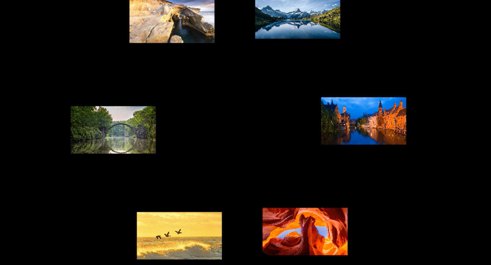
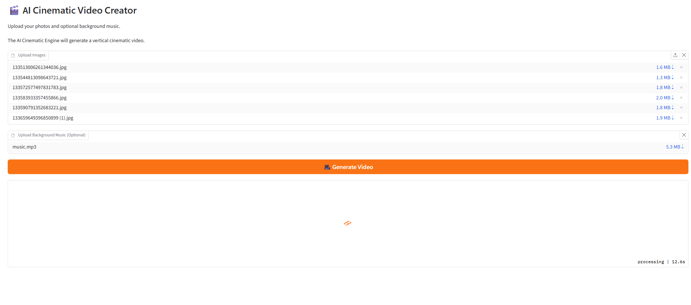

# Andreas Mokam | Senior DevOps Engineer Portfolio

Senior DevOps Engineer with 9+ years of experience designing,
automating, and supporting cloud infrastructure, CI/CD pipelines,
Kubernetes platforms, and production systems.

## Core Expertise

- AWS Cloud Engineering
- Kubernetes Platform Engineering
- Terraform Infrastructure as Code
- DevSecOps Automation
- CI/CD Pipeline Engineering
- Python Application Development

## Featured Project

# AI Cinematic Video Creator Engine V5

AI-powered cinematic video generation platform transforming static
images and music into professional travel videos.

Technology:

- Python
- FFmpeg
- MoviePy
- Gradio
- Hugging Face Spaces

## Project Screenshots

## Engineering Documentation

- Project Details: [PROJECTS](projects/PROJECTS.md)
- Architecture: [ARCHITECTURE](docs/ARCHITECTURE.md)

## Certifications

- HashiCorp Certified: Terraform Associate

## Portfolio

GitHub:

https://github.com/monkamtanyi

Live Demo:

https://huggingface.co/spaces/monkamtanyi/cinematic-engine-v5
